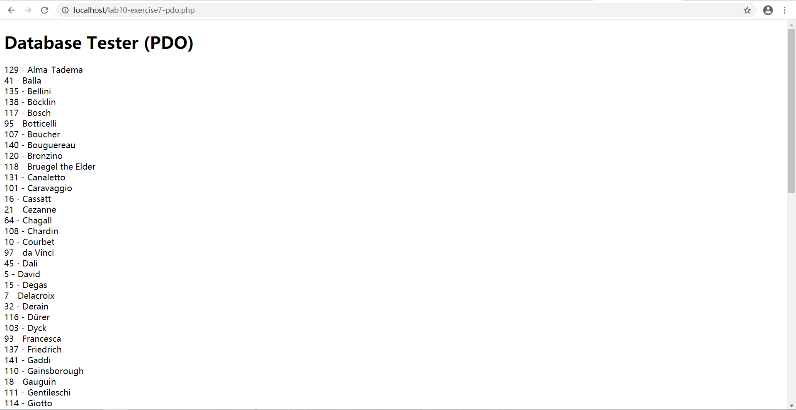
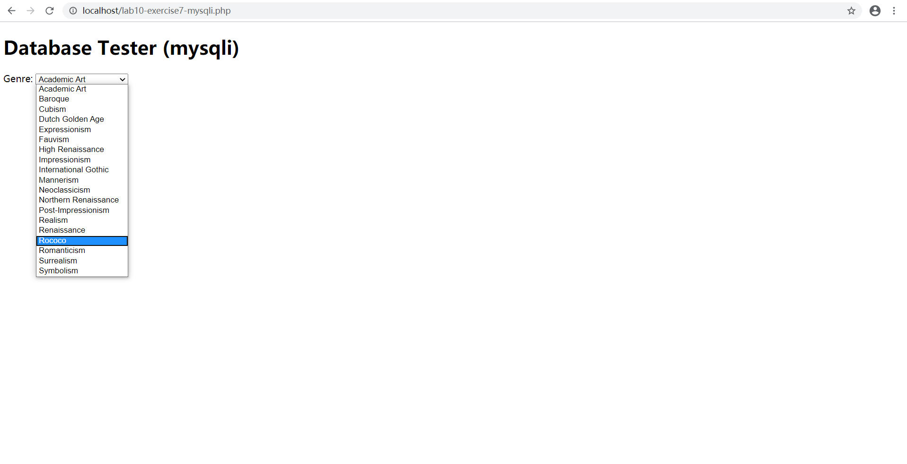
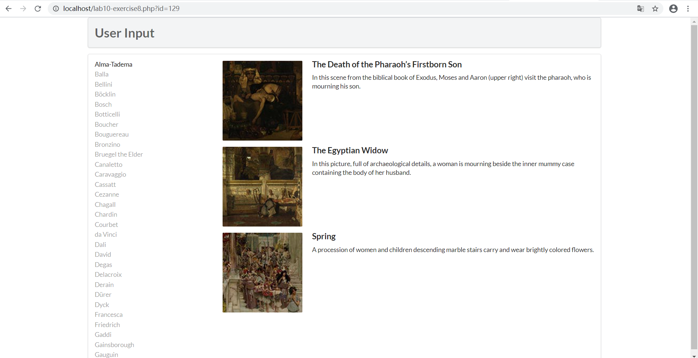
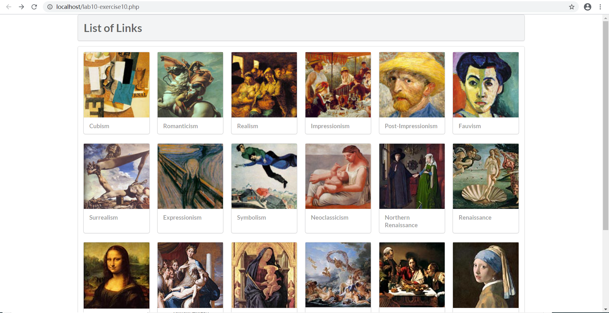

Lab10设计文档

exercise7:

在exercise7-pdo.php中创建了一个PDO基类的实例访问数据库，将数据库中的ArtistID和LastName按照LastName排序展示；在exercise7-mysqli.php中使用MySQLi创建连接，访问数据库中的Genre，按照GenreName在option中排序。

exercise8：

function outputArtists() 访问数据库中的Artists并按照LastName排序选取前30个并创建连接

function outputPaintings()按照Artistid访问数据库中的Paintings得到result

function outputSinglePainting()创建图片展示的部分，将单张图片的src,description,title分别输出

exercise9:

一、基本接口或类

——>DriverManager：用于管理JDBC驱动的服务类。主要功能是获取Connection对象。

——>Connection：代表数据库连接对象，每个Connection代表一个物理连接会话。

——>Statement：用于执行SQL语句的工具接口。常用方法：

1、ResultSet  executeQuery（String sql）throws SQLException：专用于查询。

2、int  executeUpdate（String sql）throws SQLException：执行DDL、DML语句，前者返回0，后者返回受影响行数。

3、boolean execute（String sql）throws SQLException：可执行任何SQL 语句。如果执行后第一个结果为ResultSet（即执行了查询语句），则返回true；如果执行了DDL、DML语句，则返回false。返回结果为true，则随后可通过该Statement对象的getResultSet()方法获取结果集对象（ResultSet类型），返回结果为false，则可通过Statement对象的getUpdateCount（）方法获得受影响的行数。

——>PrepareStatement：为Statement的子接口，可预编译SQL 语句，常用语执行多条结构相同，仅值不同的SQL 语句，见下例。同样具有Statement对象常用的三个方法，但用法不同，因为已经预编译了SQL 月，所以无需再在方法中写sql语句，只需setString方法设置参数值即可，如代码中。

使用PreparedStatement比使用Statement多了三个好处：

1、PreparedStatement预编译SQL语句，性能更好，执行更快。

2、PreparedStatement无须“拼接”SQL 语句，编程更简单。

3、PreparedStatement可以防止SQL 注入（如将输入的true当成直接量，导致判断直接通过，从而降低了安全性），安全性更好。

exercise10:

访问数据库中的genre，得到所有类型后创建图片展示并添加图片链接。

