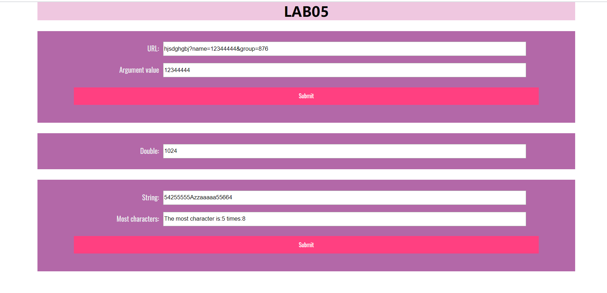
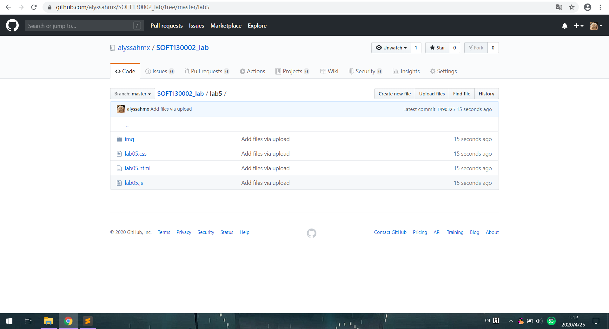

# Lab5设计文档

#### 完成图片：



#### 提交图片：




#### 知识点及解决方法

知识点：函数的嵌套定义、函数的返回、构造函数

解决方案：

（1）创建变量获取URL的值，然后通过split("&")将URL的值分为两个字符串数组。对数组进行遍历，用split（“=”）继续分割，比较数组中是否含有variable，有则将值赋给variable，最后在url_result获得值时调用函数。

（2）使用以下方法每隔五秒调用一次函数，给函数设置计数，每调用一次增加1，调用十次时清除方法。

```
let int=self.setInterval("timeTest()",5000);
```

在函数调用前获取一次当前时间的分钟，将一变量设置为分钟数加一。当函数中获取的分钟等于该变量（即增加1分钟）时，清除方法。

（3）先将获取的most的值转化为字符串，再得到i位置的字符char,判断object中变量char(i)是否存在,不存在则等于1，存在则再加1以此获得每一个字符出现次数。最后将变量max与次数比较获取出现最多次数以及对应的字符。


