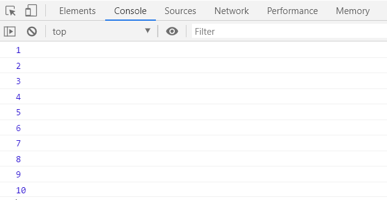
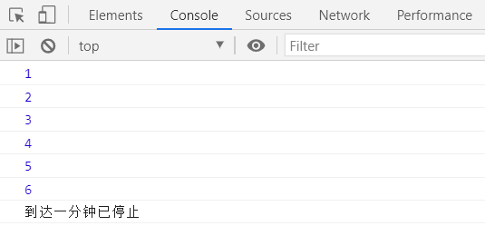
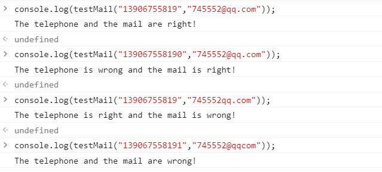
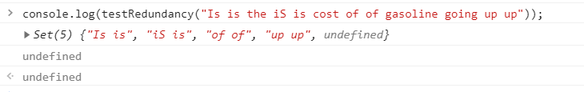
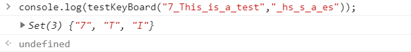
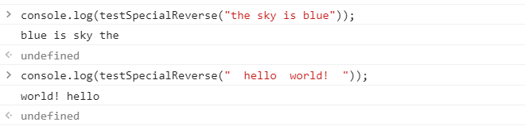
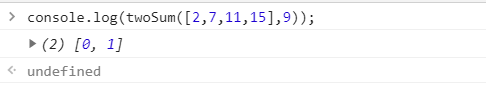
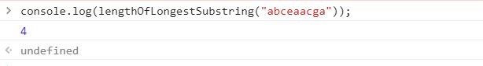
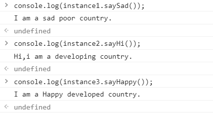
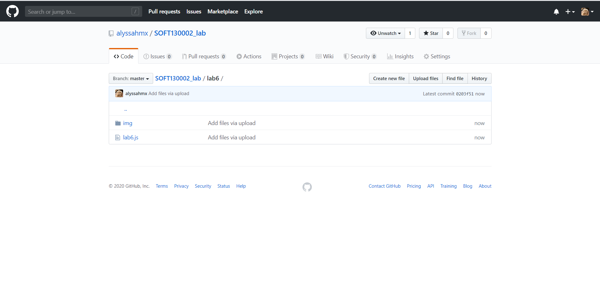

# Lab6设计文档

### 一、正则表达式理解

1、手机正则:

```
/^[1][3,4,5,7,8][0-9]{9}$/
```

即第一位为1，第二位为3、4、5、7、8之间的一位，后面9位为0-9的任意整数

2、邮箱正则：

```
/^([a-zA-Z]|[0-9])(\w|\-)+@[a-zA-Z0-9]+\.([a-zA-Z]{2,4})$/
```

匹配a-z、A-Z、0-9，下划线—，以及中划线-字符，然后匹配@字符。之后在“.”之前匹配a-z、A-Z、0-9，在“.”之后匹配2—4位的大小写字母。

3、匹配重复单词：

```
/\b([a-z]+) \1\b/ig
```

\b是匹配一个单词的边界 ，([a-z]+) 是匹配一个到多个小写字母 ，\1是引用第一个括号的内容，/ig 为不区分大小写，并且全局搜索


### 二、继承的理解

1、借助构造函数：

在子类构造函数内部调用父类构造函数，在子类实例中创建父类属性，使用call的调用方式。

2、原型链继承：

将子类的原型设为父类的实例进行继承，父类的实例属性将成为子类的原型属性。

3、Object.create：

创建一个新对象，使用现有的对象来提供新创建的对象的proto


### 三、Array、Set、Map的区别

Set：

类似于数组的有序列表，但是成员的值都是唯一的，没有重复的值。用size属性提供成员个数。可以用new关键字创建。包含操作和遍历两大类方法。

Map：

类似于对象的键值对有序列表，但键可以是任何类型的。用size属性提供成员个数。可以用new关键字创建。操作方法和遍历方法可对键名和键值进行操作。

四、命令行截图：

1-1

1-2


2、


3、


4、


5、


6、


7、


8、

提交截图：

